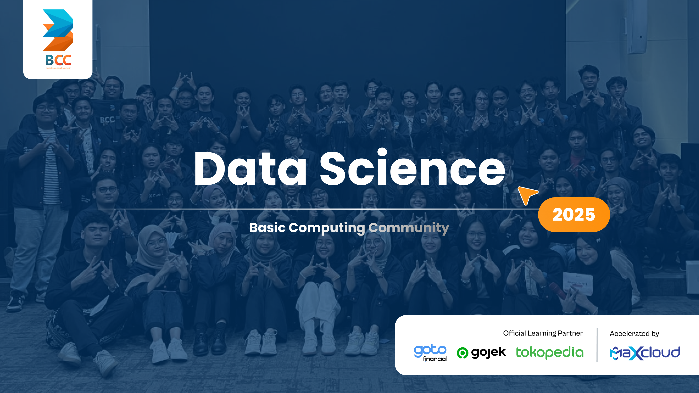

# Python Basics for Data Science

<p align="center">
  
</p>

Hello fellow BCC interns and aspiring data scientists! 👋

This BCC Data Science Department repository is your friendly guide to mastering the fundamentals of Python with a focus on skills that are essential for data science. Here, you'll learn basic programming concepts such as data types, loops, conditionals, functions, Object-Oriented Programming (OOP), etc to build a solid foundation for your data science journey.

## What You'll Learn

- **Python Basics:**  
  Get started with variables, data types, operators, and expressions.

- **Control Flow:**  
  Understand loops (`for`, `while`) and conditionals (`if`, `elif`, `else`).

- **Functions:**  
  Learn how to create and use functions to write reusable code.

- **Object-Oriented Programming (OOP):**  
  Dive into classes, objects, methods, inheritance, and more.

- **Practical Examples:**  
  Apply these concepts with examples and exercises that prepare you for more advanced topics in data science.

## Getting Started

1. **Navigate to the Project Directory:**

    ```bash
    cd your-repo-name
    ```
2. **Clone the Repository:**

    ```bash
    git clone https://github.com/diyangraditya/BCC-python-for-DS.git
    ```

3. **Explore the Examples:**
  - Browse through the folders to find lessons on Python basics.
  - Run the examples and exercises to practice your skills.

## Additional Resources

For further learning, check out these resources:
- [Python Official Documentation](https://docs.python.org/3/)
- [Automate the Boring Stuff with Python](https://automatetheboringstuff.com/)
- [Codecademy](https://www.codecademy.com/)
- [GeeksforGeeks (personal recommendation)](https://www.geeksforgeeks.org/)
- [Hackerrank](https://www.hackerrank.com/)
- [W3schools](https://www.w3schools.com/)
- [freeCodeCamp](https://www.freecodecamp.org/)
- [DataCamp](https://app.datacamp.com/)
- [Udemy](https://www.udemy.com/)

Feel like a pro? Test yourself at :
- [Hackerrank (personal recommendation)](https://www.hackerrank.com/)
- [LeetCode (personal recommendation)](https://leetcode.com/)
- [stratascratch](https://platform.stratascratch.com/coding?code_type=3)
- [codeforces](https://codeforces.com/)
- [algoexpert](https://www.algoexpert.io/product)


### Happy Coding!!

*Maintained by [diyrad](https://github.com/diyangraditya)*